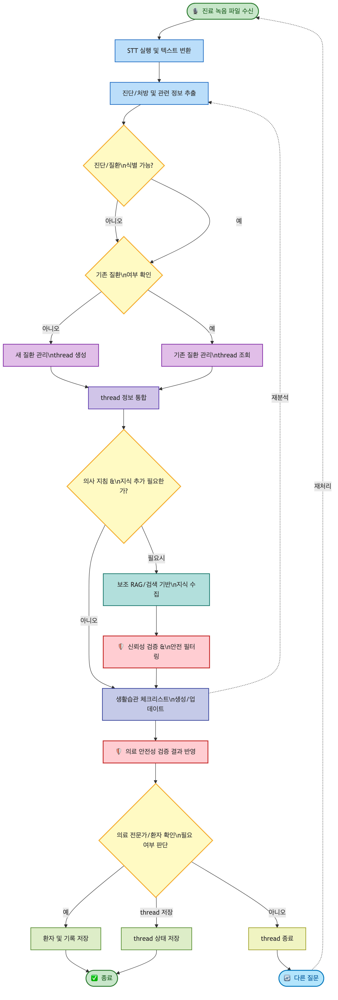

# 멘토링 리뷰: Agent 기반 진료 관리 서비스 기획서

> 리뷰 일자: 2026-02-11
> 대상 문서: 의료 서비스 기획서(re).docx.md
> 리뷰 초점: **Agent Workflow 설계의 적절성과 구현 가능성**

---

## 총평

문제 정의가 탄탄하고, "환자 관점의 기록 관리"라는 차별점이 명확합니다. 5 Whys를 통한 근본 원인 도달, 페인 포인트→가치→기능으로 이어지는 논리 구조도 잘 잡혀 있습니다.

다만 **Agent Workflow 관점에서 보면, "왜 Agent인가"는 설명되어 있지만 "Agent가 구체적으로 어떻게 동작하는가"가 부족합니다.** WFState까지 정의한 것은 좋으나, 노드 구성, 라우팅 로직, 에러 핸들링, Human-in-the-Loop 등 Agent 시스템의 핵심 설계가 빠져 있어 기획서만으로는 구현에 바로 착수하기 어렵습니다.

---

## 1. 프로젝트 주제 선정

### 평가: 우수

- **"헬스 리터러시 격차"**라는 실제적 사회 문제를 포착한 점이 좋습니다
- 기존 의료 AI가 "의료진 업무 지원"에 치중하는 가운데, **"환자 관점"**으로 방향을 잡은 것은 명확한 차별점
- Agent 도입의 필요성(오케스트레이션, 맥락 유지, 개인화)도 논리적으로 잘 연결됨

### 보완 필요

- **왜 이 문제에 "Agent"가 필요한가?** 현재 기획서는 "AI 에이전트 도입이 필요하다"고 선언만 하고 있음. 단순 LLM 파이프라인이 아닌 Agent여야 하는 이유를 더 구체적으로 보여줘야 합니다
  - 예: "진료 녹음 → STT → 구조화 → Q&A"가 단순 체인으로 가능한가, 아니면 상태에 따라 분기하고 도구를 선택하는 Agent적 동작이 필요한가?
  - Agent의 **자율적 판단이 개입하는 지점**이 어디인지 명시하면 설득력이 높아집니다

---

## 2. 문제정의의 명확성

### 평가: 우수

- 5 Whys 분석이 논리적이며, 근본 원인("진료 이후 환자 일상으로 이어지는 개인화된 정보 전달 구조 부재")까지 잘 도달함
- 근본 원인 검증 표가 있어 자기 검증 구조를 갖추고 있음
- 페인 포인트 3개와 기회 3개가 1:1로 명확하게 대응됨

### 보완 필요

- **사용자 정의가 빠져 있습니다.** "환자"라고만 표현하고 구체적으로 누구인지 정의되지 않음
  - 타겟 사용자: 고령 만성질환자? 초진 환자? 정기 검진 대상자?
  - 페르소나 최소 2-3개 (나이, 질환, 디지털 리터러시 수준, 진료 빈도)
  - 헬스 리터러시가 낮은 사용자가 타겟이라면, **그 사용자가 이 앱을 사용할 수 있는가?**라는 역설적 질문에도 답해야 합니다
- **사용자 플로우가 없습니다.** 기능 3개가 입력→처리→출력으로 정리되어 있지만, 사용자가 실제로 **어떤 화면에서 무엇을 하는지** 흐름이 필요합니다
  - 플로우 1: 진료 녹음 → 기록 확인 → Q&A
  - 플로우 2: 관리 항목 확인 → 체크리스트 수행 → 경과 확인
  - "진료 녹음"을 사용자가 어떻게 시작하는가? (앱 내 녹음? 파일 업로드?)

---

## 3. 기술 구현의 명확성 — Agent Workflow 심층 리뷰

이 섹션이 이번 리뷰의 핵심입니다. 기획서의 Agent Workflow 설계를 구체적으로 평가합니다.

### 3.1 오케스트레이션: ReAct vs Workflow — 결정이 필요합니다

**현황:** 186행에서 "ReAct vs Workflow (하단 설명)"이라고 병기하고, 이후 ReAct 다이어그램과 Workflow State를 모두 제시하고 있습니다. 그런데 **최종 선택이 명시되어 있지 않습니다.**

**조언:**
- 의료 도메인에서는 **Workflow(명시적 상태 머신) 방식을 강력히 권장**합니다
  - ReAct는 LLM이 "다음에 무엇을 할지" 매 턴마다 자율 판단 → 예측 불가능한 동작 가능성
  - 의료 정보 제공에서 예측 불가능성은 곧 **안전성 리스크**
  - Workflow는 각 단계가 명시적으로 정의되어 있어 디버깅, 감사(audit), 테스트가 용이
- WFState를 이미 정의한 것으로 보아 사실상 Workflow를 선택한 것 같지만, **기획서에 "Workflow 방식을 선택한다"고 명시하고 그 이유를 적어야** 합니다
- ReAct가 필요한 부분이 있다면(예: Q&A 기능에서 환자의 자유로운 질문에 대응), **특정 노드 내부에서만 ReAct를 사용하는 하이브리드 구조**도 가능합니다. 이런 설계 판단을 보여주세요

### 3.2 아키텍처 다이어그램 재구성

기획서의 아키텍처 다이어그램(image1)이 깨져서 텍스트를 읽기 어렵습니다. 이미지에서 판독한 내용을 기반으로 Mermaid로 재구성하면 다음과 같습니다:



> **참고**: 원본 이미지의 텍스트가 매우 희미하여 일부 판독이 부정확할 수 있습니다. 학습자에게 원본 Word 파일과 대조하여 검증할 것을 권장합니다.

**조언 — 이 다이어그램은 "논리적 순서도"이지 "Agent Workflow"가 아닙니다**

재구성된 다이어그램을 보면, 다이아몬드(분기) → 직사각형(처리) → 화살표(순서)로 이루어진 전형적인 **데이터 처리 순서도(Flowchart)**입니다. "녹음 파일이 들어오면 → STT하고 → 추출하고 → 분기하고 → 저장한다"는 흐름으로, **"데이터가 어떤 순서로 변환되는가"**를 보여줄 뿐 **"어떤 Agent가 무엇을 담당하는가"**는 보여주지 않습니다.

반면 기획서의 ReAct 구조도(image3)는 Master Agent → 하위 Agent(STT, Diagnosis, Q&A, DB, RAG, Report)로의 위임 관계와 각 Agent의 도구(tool)를 보여주고 있어 오히려 Agent적 관점에 더 가깝습니다.

| 관점 | 현재 아키텍처 다이어그램 | Agent Workflow가 보여줘야 할 것 |
|:--|:--|:--|
| 주어 | "데이터" (녹음 → 텍스트 → 정보) | "Agent" (STT Agent가, Diagnosis Agent가) |
| 분기 기준 | 논리 조건 (진단 식별 가능?) | **상태(State) 기반 라우팅** (has_diagnosis → 어떤 노드로?) |
| 노드 의미 | 처리 단계 (추출, 통합, 필터링) | **Agent 노드** (입력/출력/도구/실패동작 포함) |
| 누락된 것 | Agent 경계, 도구 호출, 에러 핸들링 | **누가 결정하는가** (규칙 vs LLM 판단) |

**순서도와 Agent Workflow의 결정적 차이는 "자율성의 소재"입니다.** 순서도에서는 모든 분기가 미리 정해진 조건(if-else)에 의해 결정되지만, Agent Workflow에서는 특정 노드에서 LLM이 판단하여 다음 경로를 결정합니다. 현재 다이어그램의 다이아몬드("의사 지침 & 지식 추가 필요한가?")에서 이 판단을 **누가** 하는가—하드코딩된 규칙인가, LLM인가—가 Agent Workflow의 핵심인데, 순서도에서는 이 구분이 드러나지 않습니다.

**권장:** ReAct 구조도의 "누가 하는가" 관점과 현재 순서도의 "어떤 순서로 하는가" 관점을 합쳐서, **LangGraph 스타일의 State Graph**로 재구성하세요. 각 노드에 (1) 어떤 Agent/도구를 쓰는지, (2) State의 어떤 필드를 읽고 쓰는지, (3) 분기 조건이 규칙인지 LLM 판단인지를 명시해야 합니다.

### 3.3 WFState 설계 — 구조는 있으나 노드/엣지가 없습니다

**현황:** WFState가 TypedDict로 정의되어 있고, input/intermediate/output 구분이 있습니다:

```
# input: patient_id, visit_id, transcript
# intermediate: stt_result, extracted_info, ...
# 환자 맥락: has_guideline, doctor_summary
# 외부 지식 검색: tavily_query, tavily_raw, rag_guidelines, safe_guidelines
# output: final_answer
```

**조언 — 반드시 추가해야 할 것들:**

**(1) 노드(Node) 정의**
WFState는 "어떤 데이터가 흐르는가"만 보여줍니다. **"어떤 처리 단계가 있는가"**가 빠져 있습니다. 최소한 다음 수준의 노드 정의가 필요합니다:

```
예시 노드 구성:
1. stt_node: transcript → stt_result (음성→텍스트 변환)
2. extract_node: stt_result → extracted_info (핵심 정보 추출)
3. classify_node: extracted_info → 진단/처방/주의사항 분류
4. context_node: 기존 환자 기록과 병합 (맥락 보존)
5. guideline_node: RAG 검색으로 관련 가이드라인 조회
6. safety_node: 생성된 정보의 의료 안전성 검증
7. output_node: 최종 응답 생성
```

각 노드별로 입력/출력, 사용 도구(tool), 실패 시 동작을 정의하세요.

**(2) 라우팅/분기 로직 (Conditional Edge)**
상태에 따라 다음 노드가 달라지는 분기점이 반드시 있을 텐데, 이것이 설계되어 있지 않습니다:
- `has_guideline`이 True/False일 때 경로가 어떻게 달라지는가?
- `should_close`가 True면 어디로 가는가?
- 환자 질문이 진료 내용에 관한 것인가, 생활습관에 관한 것인가에 따른 분기는?

**(3) 에러 핸들링 / Fallback**
의료 도메인에서 에러 핸들링은 필수입니다:
- STT가 실패하거나 신뢰도가 낮을 때 → 어떻게 처리?
- LLM이 의료적으로 위험한 답변을 생성할 때 → 안전장치는?
- 외부 API(Tavily, Whisper) 장애 시 → 대체 경로는?

**(4) Human-in-the-Loop**
Agent 시스템에서 사람의 개입이 필요한 지점을 설계해야 합니다:
- AI가 생성한 진료 요약을 환자가 **확인/수정**할 수 있는가?
- 의료적으로 민감한 권고 사항에 대해 **"이것은 AI가 생성한 정보입니다"** 같은 고지는?
- 환자가 이해하지 못할 때 **의료 전문가에게 연결**하는 에스컬레이션 경로는?

### 3.4 RAG → Tavily 대체 — 가장 우려되는 설계 판단

**현황:** 240행에서 "현재 RAG 부분 웹검색(tavily)로 대체됨"

**조언:**
이것은 Agent의 **tool 선택** 문제이며, 의료 도메인에서 가장 신중해야 하는 결정입니다.

- **의료 정보를 일반 웹검색에 의존하는 것은 위험합니다**
  - Tavily가 반환하는 웹 검색 결과는 비검증 정보를 포함할 수 있음
  - 환자에게 잘못된 건강정보가 전달되면 실제 건강 피해로 이어질 수 있음
- **권장 구조:**
  - **Primary tool**: 서울대병원 의학정보 RAG (ChromaDB) — 검증된 의료 정보
  - **Secondary tool**: Tavily 웹검색 — RAG에서 관련 정보를 찾지 못했을 때만 보조적으로 사용
  - **Safety filter**: 어떤 경로로 정보를 가져왔든, 최종 출력 전 **의료 안전성 검증 노드**를 반드시 거치도록 설계
- WFState에 이미 `rag_guidelines`와 `safe_guidelines`가 분리되어 있는 것은 좋습니다. 그런데 이 안전 필터링이 **어떤 기준으로** 작동하는지 정의가 필요합니다

### 3.5 기술 스택 미결 사항 정리

| 항목 | 현황 | 필요한 결정 |
|:--|:--|:--|
| 오케스트레이션 | ReAct vs Workflow 병기 | **하나를 선택하고 근거 명시** |
| STT | Whisper vs Daglo 병기 | **화자 분리가 핵심이므로** 선정 기준과 선택 결과 명시 |
| RAG vs Tavily | RAG를 Tavily로 대체 | **RAG 유지 + Tavily 보조** 구조로 재설계 권장 |
| Solar pro2 | 역할 "두뇌" | 선정 근거(의료 한국어 성능, 비용, 라이선스) 필요 |
| 프레임워크 | 미언급 | LangGraph, CrewAI 등 어떤 Agent 프레임워크를 쓸 것인지 |

---

## 4. 프로젝트 제작의 현실성

### 실현 가능한 부분
- MVP를 기능1(진료 기록 자동화) + 기능2(생활습관 관리)로 좁힌 것은 합리적
- WFState까지 정의한 것은 실제 개발 의지가 있음을 보여줌
- 기술 스택(Solar, ChromaDB, PostgreSQL)은 모두 접근 가능한 도구

### 현실성에 대한 우려

**(1) 데이터 확보가 최대 병목**
- 기능1 검증에는 **실제 진료 녹음 데이터**가 필요합니다
- 병원 협력? 시뮬레이션 데이터? 공개 데이터셋? → 이 전략이 없으면 프로토타입 제작 자체가 불가능
- 의사-환자 대화의 화자 분리 + 의료 전문용어 인식은 범용 STT로 충분한가?

**(2) 법적/규제 리스크 미검토**
기획서에 규제/법적 검토가 전혀 없습니다. 의료 도메인에서 이것은 치명적입니다:

- **진료 녹음:** 의사 동의 필요 여부, 녹음 데이터 보관/삭제 정책, 암호화 방식
- **의료 데이터:** 개인정보보호법(PIPA), 의료법상 민감정보 처리, 클라우드 저장 규제
- **AI 생성 정보:** 생활습관 권고가 "의료 행위"에 해당하는가? → 식약처 SaMD 규제 대상 가능성
- **면책:** AI가 잘못된 건강정보 제공 시 책임 범위

**(3) 비즈니스 모델 부재**
- B2C(환자 구독)? B2B(병원 납품)? B2B2C(보험사 제휴)?
- "환자가 비용을 지불할 것인가?" 또는 "병원이 도입할 동기가 있는가?"에 대한 가설 필요

**(4) 성공 기준(KPI)과 로드맵이 없음**
- STT 정확도 목표, 구조화 정확도, 사용자 만족도 등 측정 가능한 지표가 필요
- 어떤 순서로 어떤 기능부터 구현할 것인지 타임라인이 필요

---

## 5. 학습자 질문

기획서를 발전시키기 위해 다음 질문들에 대한 답을 준비해 보세요:

### Agent Workflow 관련
1. **이 서비스에서 Agent가 "자율적으로 판단"하는 지점은 구체적으로 어디인가요?** 단순 파이프라인이 아닌 Agent여야 하는 이유를 한 문장으로 설명할 수 있나요?
2. **Workflow의 노드를 나열할 수 있나요?** 각 노드가 어떤 입력을 받아 어떤 출력을 내는지 정리해 보세요.
3. **Agent가 실수할 때 어떻게 되나요?** 예를 들어 "아스피린을 먹으세요"같은 잘못된 권고가 생성되면 어떤 안전장치가 작동하나요?
4. **RAG를 Tavily로 대체한 이유는 무엇인가요?** 그리고 Tavily가 의료적으로 부정확한 정보를 반환할 위험은 어떻게 관리할 계획인가요?

### 서비스 설계 관련
5. **타겟 사용자를 한 문장으로 정의할 수 있나요?** "헬스 리터러시가 낮은 환자"보다 더 구체적으로요.
6. **진료 녹음 데이터를 어떻게 확보할 계획인가요?** 이것이 프로젝트 성패를 좌우합니다.
7. **의사가 녹음을 거부하면 어떻게 되나요?** 서비스의 핵심 전제가 무너지는 시나리오에 대한 플랜 B가 있나요?

### 기술 선택 관련
8. **Solar pro2를 선택한 이유는 무엇인가요?** GPT-4나 Claude 대비 의료 한국어에서 어떤 이점이 있나요?
9. **화자 분리(의사 vs 환자)를 어떤 기술로 구현할 계획인가요?** Whisper는 화자 분리를 기본 지원하지 않습니다.
10. **Agent 프레임워크는 무엇을 사용할 계획인가요?** LangGraph? CrewAI? 직접 구현?

---

## 6. 기타사항

### 문서 완성도
- 섹션 3이 누락, 섹션 4 내에서 4.2/4.3이 빠져 있음 → 번호 재정렬 필요
- 빈 헤더(`###`, `##`)가 47행, 80행, 106행, 108행에 남아 있음 → 삭제 필요
- 서비스명이 비어 있음 (118행) → 가제라도 반드시 기입
- "방문 의료" (40행) 설명 비어 있음 → 채우거나 삭제

### 세부 수정 사항

| 위치 | 항목 | 조언 |
|:--|:--|:--|
| 40행 | "방문 의료 :" | 설명이 비어 있음. 채우거나 삭제 |
| 44행 | 헬스 리터러시 조사 | 출처(조사기관, 연도) 명시 필요 |
| 45행 | WHO 인용 | 문서명과 연도 명시 필요 |
| 103행 | DAX 링크 | Google 검색 URL이 아닌 공식 페이지 URL로 교체 |
| 118행 | 서비스명 | 비어 있음 — 가제라도 필수 |
| 132행, 16행 | "스스로" | "스스**로**" → 오탈자 수정 |
| 185행 | Solar pro2 역할 "두뇌" | "핵심 추론 및 텍스트 생성 엔진" 등 구체적 표현으로 |
| 240행 | RAG→Tavily 대체 | 의료 도메인에서 웹검색 의존은 재고 필요 |

### 경쟁 분석 보강
- AI 도입 사례 4개가 모두 **의료진 업무 지원** 관점 → 환자 대상 서비스(Ada Health, K Health, 닥터나우 등) 사례 추가 필요
- **경쟁 포지셔닝 맵** (의료진 중심 vs 환자 중심 / 일회성 vs 지속 관리)으로 차별화 시각화 권장

### 시장 분석 보강
- 헬스 리터러시 데이터(70.9%)만으로는 부족 → 디지털 헬스케어 시장 규모/성장률 추가
- TAM → SAM → SOM 구조로 시장 기회 구체화 권장

---

## 우선순위별 액션 정리

### 즉시 수정 (문서 완성도)
1. 섹션 번호 정리 및 빈 헤더 제거
2. 서비스명 기입
3. 빈 항목(방문 의료) 및 오탈자 수정

### 핵심 보완 (Agent Workflow)
4. **오케스트레이션 방식 최종 선택 및 근거** (ReAct vs Workflow)
5. **노드 정의**: 각 처리 단계의 입력/출력/도구/실패 동작
6. **라우팅 로직**: 상태 기반 분기 조건 명시
7. **RAG + Tavily 이중 구조 설계**: RAG를 primary로 복원, Tavily는 보조
8. **안전성 설계**: 에러 핸들링, 의료 안전 필터, Human-in-the-Loop

### 반드시 추가 (서비스 기획)
9. 타겟 사용자 정의 및 페르소나
10. 사용자 플로우 (핵심 시나리오 2-3개)
11. 법적/윤리적 고려사항 (진료 녹음 동의, 의료 데이터 규제, AI 면책)
12. 경쟁 분석 및 차별화 포지셔닝

### 보강 권장 (설득력 향상)
13. 기술 스택 선정 근거 (Solar, STT, Agent 프레임워크)
14. 시장 규모 정량 데이터 (TAM/SAM/SOM)
15. 성공 지표(KPI) 및 개발 로드맵
16. 비즈니스 모델 방향

---

## 마무리

기획서의 **강점은 명확**합니다: 문제 인식이 날카롭고, 페인 포인트→가치→기능으로 이어지는 논리 구조가 탄탄합니다.

**Agent Workflow 측면에서의 핵심 과제는 3가지입니다:**

1. **"무엇이 흐르는가"(WFState)에서 "어떻게 흐르는가"(노드/엣지/라우팅)로 설계를 구체화**할 것
2. **의료 안전성을 보장하는 설계**(안전 필터 노드, RAG 우선 전략, Human-in-the-Loop)를 명시할 것
3. **기술 선택을 확정**하고 각각의 근거를 제시할 것 (오케스트레이션, STT, RAG/검색, 프레임워크)

이 세 가지가 기획서에 추가되면, "좋은 문제 정의"에서 "구현 가능한 Agent 시스템 설계"로 한 단계 올라갈 수 있습니다.
