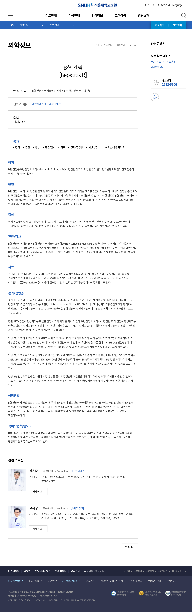
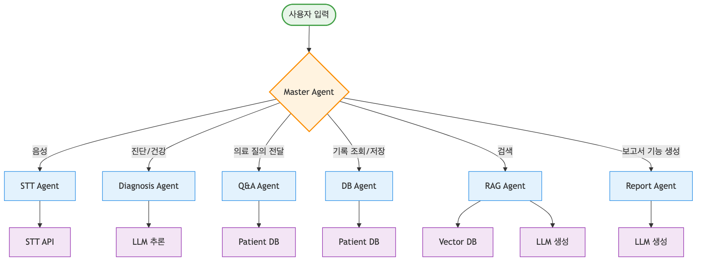

# **서비스 기획서: Agent 기반 진료 관리 서비스**

## **1\. 도메인 선택 및 시장 분석**

### **1.1 서비스 선정 배경**

**선택 도메인**

* 의료(헬스 리터러시)

**선택 이유**

* 의료 서비스에 대한 경험 격차가 지속적으로 확대되고 있음.  
* 이 격차는 헬스 리터러시, 즉 건강정보 이해 능력의 차이에서 발생함.  
* 동일한 의료를 제공받아도 헬스 리터러시가 낮은 집단에서 경험의 질이 낮게 나타남.  
* 건강 상태가 나쁜 집단일수록 의료 이용 과정에서 부정적 경험이 누적됨.  
* 헬스 리터러시 격차는 의료 불평등으로 직접 연결됨.

**AI 도입의 필요성**

* 환자가 자신의 질환과 상태를 능동적으로 판단하기 어려움.  
* 진료 이후 필요한 행동을 이해하고 실천하는 데 한계가 있음.  
* 헬스 리터러시 증진을 위해 개인 단위의 지속적 지원이 필요함.  
* 이를 위해 개인 맞춤형 AI 에이전트 도입이 필요함.

**Agentic Workflow 도입의 필요성**

* **여러 기능을 오케스트레이션하여 관리** : 의료진과의 면담 과정에서 발화 내용을 실시간으로 구조화하여 요약하고, 면담 이후 환자의 추가 질문에 따라 단계적으로 설명을 제공함으로써 정보 이해를 보조함  
* **사용자 맥락 정보 유지** : 환자의 이전 진료 기록을 지속적으로 유지하여 누적된 진료 기록을 기반으로 사용자 맥락을 보존하고, 이를 통해 생활습관 개선을 장기적으로 지원할 수 있음.  
* **개인화된 서비스 제공** : 축적된 환자 정보를 기반으로 개인화된 서비스를 제공할 수 있고, 라이프스타일 관리 및 사후관리 정보를 개인 수준에 맞게 제공할 수 있음

### **1.2 시장 현황 및 가치**

**주요 트렌드**

1. 건강정보 이해능력(Health Literacy) : 수많은 건강정보 중에서 자신에게 적합하고 신뢰성 있는 정보를 선별하고 이해하며, 이를 본인의 건강상태와 생활양식에 적합하도록 활용할 수 있는 능력  
2. 모바일 헬스케어 : 의학 및 공중보건에서 모바일 장치를 활용하는 것  
3. e헬스/m헬스 : 의학이 개입하는 임상 현장, 보건 영역에서 정보통신기술을 활용하는 것  
4. 방문 의료 :   
5. 건강형평성 : 집단 간에 불공정하고 예방·치료 가능한 건강 격차가 없는 상태.

**서비스의 기회**

* 트렌드 : 2020년 성인 1,002명 대상으로 헬스 리터러시 조사 결과, 적정 수준은 29.1%, 부족·경계가 70.9%로 다수가 어려움을 겪음  
* 트렌드 :  WHO는 건강형평성 개선을 위해 1\) 일상적 삶의 조건 개선, 2\) 권력·자원 분배의 불평등 완화, 3\) 문제 측정과 정책 효과 평가를 핵심 원칙으로 제시함.

### 

### **1.3 근본 원인 분석: 5 Whys**

**관찰된 현상**  
**“헬스 리터러시가 떨어지는 환자들은 불만족스러운 의료 서비스를 경험하게 된다”**

* **Why 1: 헬스 리터러시가 떨어지는 이유는 무엇인가?**  
  * → 다수 요인(접근성 부족, 전문용어 위주 기록, 신뢰가는 정보 구별의 어려움 등).  
      
* **Why 2: 불만족스러운 의료 서비스 경험은 왜 발생하는가?**  
  * → 진료 내용 및 사후 관리를 충분히 이해하지 못한 상태로 의료 서비스를 방문함.  
      
* **Why 3: 사후관리를 왜 실천하지 않는가?**  
  * → 진료 후 관리의 필요성과 방법을 정확히 이해하지 못함.  
      
* **Why 4: 왜 정보를 능동적으로 찾아보지 않는가?**  
  * → 의료진과의 진료 이후 사후관리 정보를 스스로 찾아야 하는 부담이 큼.

* **Why 5 (근본 원인)**  
  * → 공식적인 의료정보 제공 체계가 진료 시점에만 집중되어 있음.  
  * → 진료 이후 환자 일상으로 이어지는 개인화된 정보 전달 구조가 부재함.  
  * → 개인 진료기록과 연계하여 환자에 맞는 건강정보를 제공하는 어플리케이션이 필요함.

**근본 원인 검증**

| 검증질문 | 답변 |
| :---- | :---- |
| 이 근본 원인을 해결하면 처음 현상이 개선될 것 같은가? | 본 서비스와 함께 최초 의료 서비스 접근성을 높이기 위한 추가적인 지원이 병행될 필요가 있음. |
| 이 근본 원인은 AI 기술로 해결 가능한 영역인가? | 개인 진료 맥락을 이해하고 지속적으로 정보를 제공하는 영역으로 AI 적용이 가능함. |
| 기존 솔루션들이 왜 이 문제를 해결하지 못했는지 설명할 수 있는가? | 기존 의료 서비스가 의료진 중심적 접근에 머물러 환자의 이해와 사후 행동을 충분히 지원하지 못했음. |
| 이 원인이 해결되면 사용자 행동이 근본적으로 바뀔 수 있는가? | 사용자의 헬스 리터러시 증진을 통해 의료 정보 탐색과 사후관리 행동 변화가 기대됨. |

### 

### **1.4 핵심 페인 포인트 및 기회**

| 페인 포인트 | 기회 | 우선순위 |
| :---- | :---- | :---- |
| **맞춤 건강 정보** **확인의 어려움** : 자신의 질환, 현재 상태, 복약 현황에 맞는 설명과 관리 지침을 일관된 형태로 확인하기 어려움 | **개인화된 진료기록 관리 시스템** : 진료 녹음(STT) 기반으로 진료 핵심 내용을 자동 구조화하고, 환자별 질환 관리 스레드로 누적 관리하여 “내게 해당되는 정보”만 한눈에 제공 | 높음 |
| **환자 입장의 서비스 부족** : 의료진은 환자 기록을 열람하고 누적 관리하지만, 환자는 진료 후 기억과 단편적 서류에 의존해 기록을 체계적으로 관리하기 어려움 | **이전 진료 기록을 토대로 한 맥락 보존** : 과거 진료에서의 변화(증상 경과, 검사 수치 추이, 약 변경, 악화 신호)를 연속적으로 연결해 다음 진료 시에도 동일 질환 맥락을 유지하고, “이번 진료에서 달라진 점”을 중심으로 요약 제공 | 높음 |
| **일회성 의료 서비스** : 진료실 밖에서의 실행(복약, 식단, 운동, 추적 관찰)이 체계적으로 이어지지 않아 생활습관 개선과 지속 관리로 연결되지 못함 | **생활습관 개선 보조** : 진료에서 나온 행동 지침을 일상 단위 체크리스트로 전환하고(복약 확인, 수분 섭취, 운동, 경고 증상 점검 등), 수행 여부를 확인 및 리마인드하며, 진료에서 안내가 부족한 항목은 외부 근거 기반 정보로 보완해 환자 맞춤형 실천 계획으로 연결 | 높음 |

## **2\. 주요 AI 도입 사례**

### **2.1 국내 사례 분석**

| 기업 | 서비스 | 주요성과 |  |
| :---- | :---- | :---- | ----- |
| 서울아산병원 | [AI 진료 음성인식 시스템](https://news.amc.seoul.kr/news/con/detail.do?cntId=10524) | 응급부터 외래까지 의료진·환자 대화를 실시간으로 기록·요약해 EMR까지 자동화하는 AI 진료 음성인식 시스템을 국내 최초로 전면 구축함. |  |
| 연세대학교 | [와이낫(Y-Knot)](https://phidigital.co.kr/business/ai) | 전공의 공백 대응을 위해 임상 데이터 기반 한국어 특화 LLM Y-KNOT을 EMR에 연동해 응급실·마취 기록부터 자동 생성·표준화하는 AI 의무기록 작성 시스템을 구축·확대 적용함. |  |

### **2.2 해외 사례 분석**

| 기업 | 서비스 | 주요성과 |  |
| :---- | :---- | :---- | ----- |
| 뉘앙스 | [닥스(DAX)](http://google.com/search?q=dragon+ambient+experience&sca_esv=d4cfef7d5aeed196&sxsrf=ANbL-n6MUUBXEdXTVyBB4JV_b6NWCxycNw%3A1770707317754&ei=ddmKacviLeTL1e8PkejLgQs&biw=1536&bih=791&ved=0ahUKEwiL8bPlrs6SAxXkZfUHHRH0MrAQ4dUDCBE&uact=5&oq=dragon+ambient+experience&gs_lp=Egxnd3Mtd2l6LXNlcnAiGWRyYWdvbiBhbWJpZW50IGV4cGVyaWVuY2UyBxAjGLADGCcyChAAGEcY1gQYsAMyChAAGEcY1gQYsAMyChAAGEcY1gQYsAMyChAAGEcY1gQYsAMyChAAGEcY1gQYsANI5QdQlwdYlwdwAXgBkAEAmAEAoAEAqgEAuAEDyAEA-AEBmAIBoAIDmAMAiAYBkAYGkgcBMaAHALIHALgHAMIHAzAuMcgHAoAIAQ&sclient=gws-wiz-serp) | 진료 중 의사-환자 대화를 실시간 녹음하고 GPT-4를 혼합 활용해 초면 임상노트 초안을 자동 생성함. |  |
| AWS | [AWS헬스스크라이브](https://aws.amazon.com/ko/healthscribe/) | 생성형 AI로 진료 음성을 자동 요약·문서화하여 EHR에 연동하고 의료진 기록 부담을 크게 줄임. |  |

### 

## 

## **4\. 서비스 상세 기획**

### **4.1 핵심 가치 및 정의**

**서비스 정의**

| 항목 | 내용 |
| :---- | :---- |
| **서비스명** |  |
| **정의** | 환자 개인 진료 기록을 바탕으로 맞춤형 관리를 제공하는 Agent 시스템 |

**핵심 가치 항목**

* **맥락 보존형 개인화 관리:** 진료 녹음을 기반으로 질환별 기록을 연속적으로 축적하여, 환자 개인의 상태 변화와 진료 맥락을 끊김 없이 유지  
* **환자 주도적 진료 이해와 기록 접근성**: 의료진 중심으로 한정되던 진료 기록을 환자 관점에서 재구성해, 이해 가능하고 관리 가능한 형태로 제공  
* **일회성 진료의 생활 밀착형 전환**: 진료 지침을 일상 실천 단위로 전환하고 추적 관리하여, 실제 행동 변화와 지속적인 질환 관리로 연결

**가치 항목과 페인 포인트 연결 확인**

| 페인 포인트 | 해결하는 가치 항목 | 연결 확인 |
| :---- | :---- | :---- |
| 맞춤형 건강 정보 확인의 어려움 | 맥락 보존형 개인화 관리 | 진료 녹음에서 추출한 진단·처방·주의사항을 질환별로 구조화하고 누적함으로써, 환자 개인의 질환 맥락에 맞는 정보만 지속적으로 제공 |
| 환자 관점의 진료 기록 관리 불가 | 환자 주도적 진료 이해와 기록 접근성 | 의료진 중심 기록을 환자 이해 수준에 맞게 재구성하여, 환자가 스스로 진료 내용을 확인·회고·관리할 수 있도록 지원 |
| 진료 후 실천으로의 미연결 | 일회성 진료의 생활 밀착형 전환 | 진료에서 제시된 지침을 일상 행동 단위로 전환하고 수행 여부를 추적해, 진료가 실제 생활습관 개선으로 이어지도록 유도 |

### **4.4 핵심 기능 정의**

**기능1. 진료 맥락 기반 환자 기록 자동화**

| 항목 | 내용 |
| :---- | :---- |
| **목적** | 진료 녹음 데이터를 기반으로 환자 개인의 질환별 진료 기록을 자동 생성·누적하여, 환자 중심의 구조화된 기록 관리 제공 |
| **AI 필요성** | 비정형 음성 데이터에서 진단, 처방, 주의사항, 생활습관 등 의미 단위를 추출하고 맥락에 따라 분류·요약하기 위해 필요 |
| **입력** | 진료 녹음 데이터(STT 텍스트), 환자 정보, (필요 시) 기존 진료 기록 |
| **처리** | 진료 텍스트에서 의료 발언 식별 → 핵심 정보 추출 → 질환 단위로 구조화 → 기존 기록과 비교해 변경·추가 사항 반영 |
| **출력** | 환자별 질환 관리 기록(thread), 진료 요약, 진단·처방·주의사항 구조화 데이터 |
| **구현** | STT 결과 기반 정보 추출 모델, 질환 단위 기록 스키마, 기록 누적 및 업데이트 로직 |

**기능2. 개인 맞춤형 생활습관 관리 매니지먼트**

| 항목 | 내용 |
| :---- | :---- |
| **목적** | 환자 기록을 토대로 지속적인 질환 관리를 위한 개인 맞춤형 관리 시스템 제공 |
| **AI 필요성** | 의료진 발언의 암묵적 지침을 관리 항목으로 전환하고, 진료에서 언급되지 않은 관리 요소를 외부 근거 기반 정보로 보완하기 위해 필요 |
| **입력** | 구조화된 환자 기록, 의료진 발언에서 추출된 관리 지침, 외부 의료 가이드라인(RAG) |
| **처리** | 관리 항목 분류(복약, 생활습관, 경고 신호 등) → 환자 상태에 따른 적용 여부 판단 → 관리 항목 생성 및 스케줄링 |
| **출력** | 환자 맞춤형 관리 항목 목록, 일상 실행 체크리스트, 추적 관리 상태 데이터 |
| **구현** | 관리 항목 생성 규칙, 환자 상태 기반 조건 로직, 외부 의료 지식 RAG 연동 |

**기능3. 진료 연속성 강화를 위한 임상 기록 문서화**

| 항목 | 내용 |
| :---- | :---- |
| **목적** | 환자 관리 기록을 의료진과 공유 가능한 공식 문서 형태로 정리하여 진료 연속성과 소통 효율성 향상 |
| **AI 필요성** | 환자 중심 기록을 의료진이 이해 가능한 임상 문서 형식으로 재구성하고 요약하기 위해 필요 |
| **입력** | 환자 질환 관리 기록, 관리 수행 이력, 이전 진료 요약 |
| **처리** | 환자 기록 중 임상적으로 유의미한 정보 선별 → 의료 문서 형식에 맞게 재구성 → 요약 및 정제 |
| **출력** | 의료진 공유용 요약 보고서, 질환 경과 정리 문서, 진료 참고용 기록 |
| **구현** | 문서 템플릿 기반 요약 생성, 의료진용 출력 포맷, 기록 공유 인터페이스 |

**최소 기능 제품 범위**

* **필수 기능**  
  * 진료 맥락 기반 환자 기록 자동화  
  * 개인 맞춤형 생활습관 관리 매니지먼트

* **추후 확장 기능**  
  * 진료 연속성 강화를 위한 임상 기록 문서화

### **4.5 기술 아키텍처 및 스택**	

**레이어별 기술 스택**

| 레이어 | 기술 스택 | 역할 |
| :---- | :---- | :---- |
| **언어모델** | Solar pro2 | 두뇌 |
| **오케스트레이션 방식** | ReAct vs Workflow (하단 설명) | 에이전트가 작업하는 방식에 대한 정의 |
| **검색 증강 생성(RAG)** | ChromaDB : 초보자 사용 용이 [서울대학교병원 데이터](https://www.snuh.org/m/health/nMedInfo/nList.do) | 외부 지식을 토대로 생활습관 추천용 |
| **도구 \- STT API** | [OpenAI Whisper](https://developers.openai.com/api/docs/models/whisper-1) : 높은 인식 능력 [Daglo](https://daglo.ai/pricing) : 화자분리 및 자동 요약 기능 | STT(Speech To Text) |
| **도구 \- 환자용 DB** | PostgreSQL : 복잡한 상태 저장 가능 | 환자 데이터 저장용 |

#### **아키텍처 다이어그램**

#### **도구 및 데이터셋**

* STT API

|  | 장점 | 단점 | 금액 |
| :---- | :---- | :---- | :---- |
| **OpenAI Whisper** | 한국어 WER 3위 모델별 서비스 다름 | 의료도메인 성능 확인 사례 X | 분당 0.006달러 |
| **Daglo** | 화자 분리 가능, 자동 요약 기능 있음 | 변환 소요 시간 확인 필요 | Pro 요금제 기준 월 11,900원 |
| Naver CLOVA | 화자 분리 가능, 자동 요약 기능 있음 | 한번에 60초까지 인식 | 15초당 4원 |
| Google Cloud | 신규 고객 300$ 무료 | 한국어 성능 명확하지 않음 | 분당 0.016달러 |

* RAG 기반 데이터 : 서울대학교 의학정보 (Selinium 크롤링)  
  

#### 

#### **아키텍처 구성 후보**

1. **React**  
   
     
2. **Workflow State 정의**  
   **class WFState(TypedDict, total\=False):**  
       **\# input**  
       **patient\_id: str**  
       **visit\_id: str**  
       **transcript: str**  
     
       **\# intermediate**  
       **\# 텍스트 전처리**  
       **doctor\_text: str**  
       **extracted: Dict\[str, Any\]**  
       **has\_diagnosis: bool**  
       **diagnosis\_key: Optional\[str\]**  
     
       **\# 진단 분석(thread 등록)**  
       **is\_existing: bool**  
       **thread\_id: Optional\[str\]**  
       **thread: Optional\[Dict\[str, Any\]\]**  
     
       **\# 환자 맥락(이전 정보) 관리**  
       **has\_guideline: bool**  
       **doctor\_summary: Optional\[str\]**  
     
       **\# 외부 지식 검색 \*현재 RAG 부분 웹검색(tavily)로 대체됨**  
       **tavily\_query: Optional\[str\]**  
       **tavily\_raw: Optional\[Dict\[str, Any\]\]**  
       **rag\_guidelines: Optional\[List\[Dict\[str, Any\]\]\]**  
       **safe\_guidelines: Optional\[List\[Dict\[str, Any\]\]\]**  
     
       **should\_close: bool**  
     
       **\# output**  
       **final\_answer: Dict\[str, Any\]**

